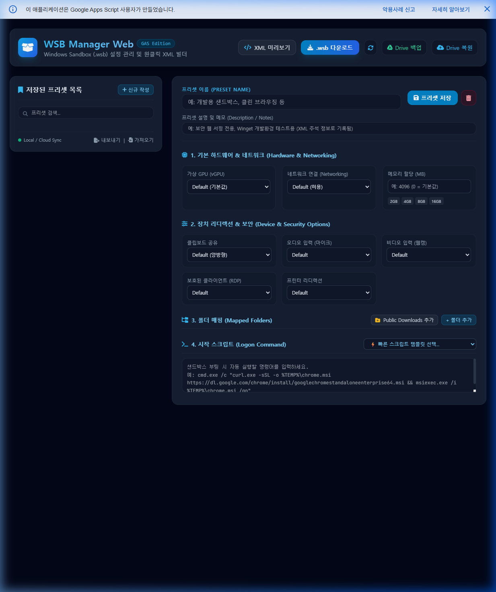

# WSB Manager Web (Google Apps Script Edition)

> **Windows Sandbox (`.wsb`) 설정 프리셋 관리 및 원클릭 빌더 웹 애플리케이션**  
> C#/UWP 기반 오픈소스 `WSBManager`를 Google Apps Script (GAS) 기반 서버리스 웹 앱으로 전면 전환 및 보완 개발한 프로젝트입니다.  
> 🌐 **Web App URL**: `https://script.google.com/macros/s/AKfycbzXjy_qz5ZuVw1qAPi0Ot3rYDTRpIox4A0y_ikyTzhZKWBc7a3gSWYhgbUzaPZCT3Bu/exec`  
> 🔗 **GitHub Repository**: [https://github.com/moozuknet/WSBManager](https://github.com/moozuknet/WSBManager)

---

## 🖼️ 메인 화면 (UI Preview)



---

## 💡 프로젝트 배경 및 개요

기존 C#/UWP 기반 `WSBManager`는 스토어 배포 중단 및 실행 파일 빌드의 번거로움이 있었습니다.  
**WSB Manager Web**은 별도 설치 없이 웹 브라우저에서 Windows Sandbox의 모든 세부 설정을 GUI 환경에서 조작하고, 프리셋으로 저장/관리하며, 단 한 번의 클릭으로 `.wsb` XML 설정 파일을 생성하여 로컬 PC로 다운로드할 수 있는 서버리스 솔루션입니다.

---

## ✨ 주요 기능 (Key Features)

### 1. 완벽한 Windows Sandbox (`.wsb`) XML 스펙 지원
- **가상 GPU (`vGPU`)**: Enable, Disable, Default
- **네트워크 (`Networking`)**: Default (허용), Disable (오프라인)
- **메모리 할당 (`MemoryInMB`)**: MB 단위 세부 조정 및 빠른 퀵 버튼 (2GB / 4GB / 8GB / 16GB)
- **폴더 매핑 (`MappedFolders`)**: 동적 행 추가/삭제, HostFolder / SandboxFolder 경로 지정, ReadOnly 토글
- **장치 리디렉션 (5종)**: 클립보드 공유 (양방향/단방향/차단), 오디오(마이크), 비디오(웹캠), RDP 보호 클라이언트, 프린터
- **시작 스크립트 (`LogonCommand`)**: UTF-16LE Base64 자동 인코딩 전환 지원으로 특수문자/줄바꿈 100% 보장

### 2. 🚀 GitHub 저장소 커스텀 설치 스크립트 모음 (`scripts/*.ps1`)
- GitHub 저장소 내 `scripts/` 폴더의 원격 `.ps1` 설치 스크립트를 원스톱으로 무음 다운로드 및 자동 실행합니다.
- **`cmd.exe /c start "Title" powershell.exe -NoExit ...` 원스톱 실행 구조**:
  - 부팅 직후 독립된 PowerShell 콘솔 창을 띄워 프로비저닝 진행률을 실시간 시각화합니다.
  - `-NoExit` 옵션을 통해 설치 완료 후에도 설치된 도구 버전(`git`, `python`, `pip`, `node`, `npm`, `code`)을 직접 확인할 수 있습니다.
- **`🚀 풀 개발자 팩` (`scripts/install-dev-tools.ps1`)**:
  - `chcp 65001` UTF-8 콘솔 강제 적용 & 네트워크 연결 30초 대기 루프
  - `Download-SafeFile` 타임아웃 5분 스트림 고속 다운로더
  - Standalone Python 3.12 + PIP 모듈 수동 프로비저닝
  - Standalone Node.js LTS + NPM 패키지 압축 해제 배포
  - Git for Windows 무음 설치 & VS Code 인스톨러 배포
  - 시스템/사용자 PATH 영구 등록 및 현재 세션 즉시 동기화
- **`🇰🇷 식탁보 Standalone 패키지` (`scripts/init-tablecloth.ps1`)**:
  - 인터넷 뱅킹 및 공공기관 서명용 Standalone TableCloth 샌드박스 환경 구축
  - 네트워크/DNS 자동 연결 검증 및 고속 무음 배포

### 3. 📋 프리셋 복사 및 다른 이름으로 저장 (Save As & Duplicate)
- **`다른 이름으로 저장 (복제)` 버튼**: 현재 수정한 폼 설정을 원본 유실 없이 새로운 프리셋으로 즉시 복사 저장합니다.
- **목록 카드별 원클릭 복제 아이콘 (`fa-clone`)**: 프리셋 카드에 마우스를 올리면 표시되는 복제 버튼을 통해 원하는 프리셋을 빠르게 복제할 수 있습니다.
- **자동 고유 이름 부여 (`getUniquePresetName`)**: 중복된 이름 저장 시 `(2)`, `(3)` 접미사를 자동으로 붙여 원본 프리셋이 덮어씌워지는 현상을 완전히 방지합니다.

### 4. 📄 이중 엔진 `.wsb` / XML 파일 가져오기 & 드래그 앤 드롭
- **Dual-Engine XML Parser**: DOMParser + Regex Extractor 2단계 파서를 적용하여 `&` 이스케이프 유무나 인코딩 차이에도 기존 `.wsb` 파일을 100% 완벽 파싱합니다.
- **창 전체 및 모달 파일 드롭 지원**: `.wsb` 파일을 브라우저 화면으로 드래그 앤 드롭하면 즉시 파싱하여 새로운 프리셋으로 자동 등록합니다.

### 5. 💡 모달 레이어 내부 클립보드 복사 알림 (In-Modal Copy Feedback)
- XML 미리보기 모달에서 `클립보드 복사` 버튼 클릭 시, 모달창 내부의 복사 버튼이 에메랄드 그린 색상의 **`✓ 복사 완료!`**로 전환되며 우측에 **`✓ 복사되었습니다!`** 네온 뱃지가 생성됩니다.
- 모달창이 상단 토스트 알림을 가리는 현상을 방지하여 팝업창을 닫지 않고도 즉시 복사 성공 여부를 확인할 수 있습니다.

### 6. ⌨️ ESC 키 & 백드롭 클릭 창 닫기
- 모든 모달 레이어(XML 미리보기, `.wsb` 파일 가져오기)에 전역 `ESC` 키 핫키 수신기 및 어두운 백드롭 영역 클릭 이벤트를 등록하여 손쉽게 모달을 닫을 수 있습니다.

### 7. 🔀 드래그 앤 드롭 프리셋 목록 순서 조정
- HTML5 File Drop 이벤트와 구분된 순수 드래그 타입 필터링(`e.dataTransfer.types.includes('Files')`)을 적용하여 좌측 프리셋 카드 목록을 마우스 드래그로 손쉽게 순서 재배치할 수 있습니다.

### 8. ☁️ 구글 클라우드(`PropertiesService`) 단일 영구 저장소
- **브라우저 로컬 스토리지(`localStorage`) 완전 제거**: 접속 기기나 브라우저에 데이터를 종속시키지 않고, 모든 프리셋 데이터 및 사용자 정의 순서를 구글 클라우드에 직접 저장합니다.
- **완벽한 크로스 디바이스 일치**: 집, 회사, 노트북 등 어느 환경에서 접속하더라도 동일한 구글 계정이라면 100% 동일한 프리셋 목록이 즉시 유지됩니다.
- **초기 기본 프리셋 자동 프로비저닝**: 백엔드에서 신규 접속 시 기본 3종 프리셋(기본 샌드박스, 풀 개발자 팩, 식탁보)을 자동 생성하여 제공합니다.
- **Google Drive 백업 폴더 연동**: 필요 시 구글 드라이브 지정 백업 폴더(`sandbox`)에 전체 프리셋 JSON 파일을 원클릭으로 백업할 수 있습니다.

---

## 📁 프로젝트 구조

```text
WSBManager/
├── .clasp.json                   # Clasp CLI 설정 파일 (scriptId 및 rootDir 지정)
├── package.json                  # 자동 배포 스크립트 모음
├── README.md                     # 프로젝트 설명 및 개발 가이드
├── WSBManager_GAS_Development_Guide.md  # 구글 Apps Script 개발 가이드 문서
├── docs/
│   └── images/
│       └── wsb_manager_main.png  # 메인 UI 스크린샷 이미지
├── scripts/
│   ├── init-tablecloth.ps1       # Standalone 식탁보(TableCloth) 자동 배포 스크립트
│   └── install-dev-tools.ps1     # 풀 개발자 팩(Git, Python, Node, VS Code) 설치 스크립트
└── src/
    ├── appsscript.json           # Google Apps Script 웹 앱 매니페스트
    ├── Code.js                   # GAS 백엔드 진입점 (doGet 및 Cloud API)
    ├── StorageService.js         # UserProperties & Google Drive 데이터 연동 모듈
    ├── WsbGenerator.js           # 서버 측 XML 생성 보조 모듈
    ├── index.html                # 메인 HTML UI 레이아웃
    ├── css.html                  # Custom CSS 스타일시트
    └── js.html                   # 프론트엔드 인터랙션, 프리셋 관리 및 .wsb 다운로드 로직
```

---

## 🚀 배포 및 설치 가이드 (Google Apps Script + Clasp)

### 사전 준비사항
* Node.js 및 npm 설치
* Google 계정 및 `@google/clasp`

### 1단계: Clasp 설치 및 로그인
```bash
npm install -g @google/clasp
clasp login
```

### 2단계: 소스 동기화 및 자동 배포
```bash
# 빌드, clasp push, 버저닝 및 프로덕션 웹 앱 배포 원클릭 실행
npm run deploy
```

---

## 📄 `.wsb` XML 구조 예시

WSB Manager Web에서 작성 및 생성되는 `.wsb` XML 설정 예시입니다:

```xml
<!--
  WSB Manager Web Generated Configuration
  Preset Name : 🚀 풀 개발자 팩 (Git + Python + Node.js + VS Code)
  Description : GitHub 저장소(install-dev-tools.ps1) 원스톱 자동 설치
  Generated At: 2026-08-26 17:00:00
-->
<Configuration>
  <VGpu>Enable</VGpu>
  <Networking>Default</Networking>
  <MappedFolders>
    <MappedFolder>
      <HostFolder>C:\Users\Public\Downloads</HostFolder>
      <SandboxFolder>C:\Users\WDAGUtilityAccount\Desktop\Downloads</SandboxFolder>
      <ReadOnly>false</ReadOnly>
    </MappedFolder>
  </MappedFolders>
  <LogonCommand>
    <Command>cmd.exe /c start "Dev Auto Setup" powershell.exe -NoExit -ExecutionPolicy Bypass -Command "[Net.ServicePointManager]::SecurityProtocol = 3072; iex ((New-Object Net.WebClient).DownloadString('https://raw.githubusercontent.com/moozuknet/WSBManager/main/scripts/install-dev-tools.ps1'))"</Command>
  </LogonCommand>
  <MemoryInMB>8192</MemoryInMB>
  <AudioInput>Default</AudioInput>
  <VideoInput>Default</VideoInput>
  <ProtectedClient>Default</ProtectedClient>
  <PrinterRedirection>Default</PrinterRedirection>
  <ClipboardRedirection>Default</ClipboardRedirection>
</Configuration>
```

---

## 📝 라이선스 (License)

본 프로젝트는 [MIT License](LICENSE)를 따릅니다.
